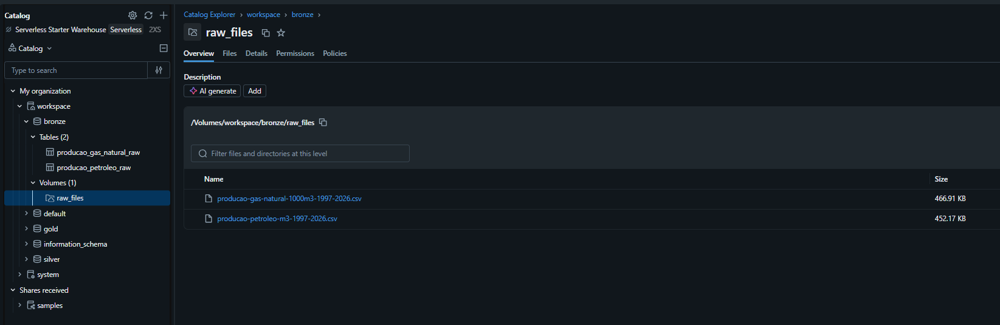
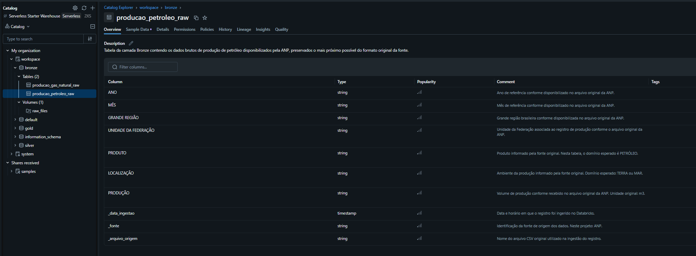
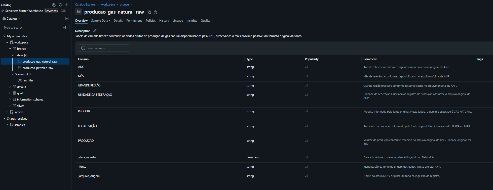
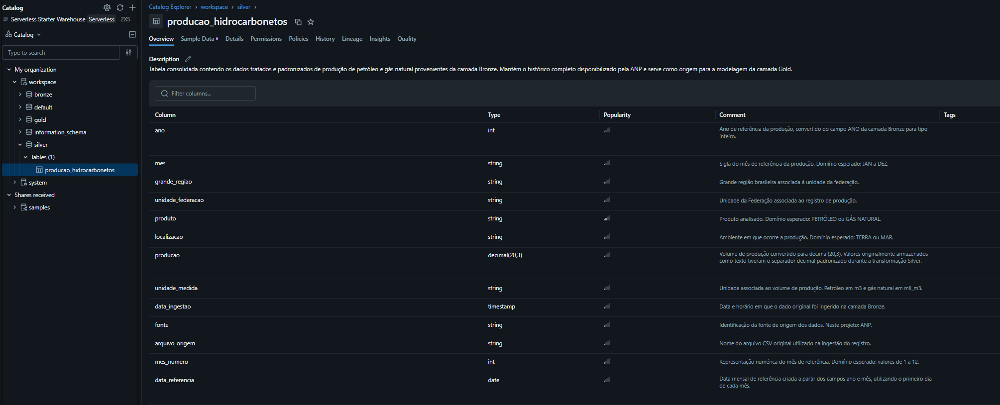
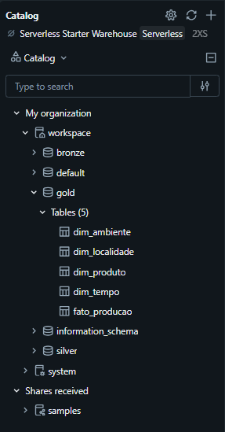
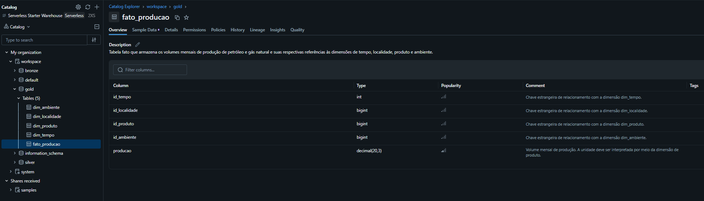
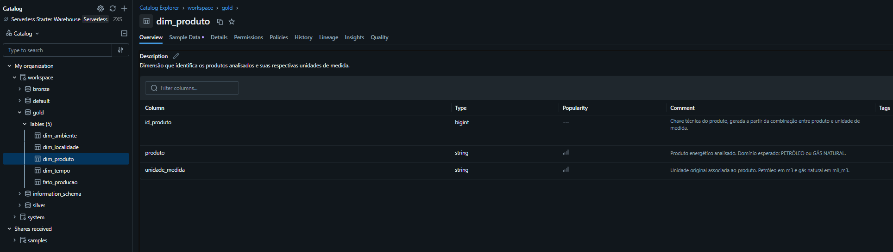

# MVP de Engenharia de Dados

## Pipeline de Dados para Análise da Produção de Petróleo e Gás Natural no Brasil

Este projeto foi desenvolvido como parte do MVP da disciplina de Engenharia de Dados e tem como objetivo demonstrar a construção de um pipeline completo de dados, desde a aquisição dos dados brutos até sua disponibilização em uma estrutura analítica adequada para geração de informações de negócio.

O projeto utiliza dados públicos disponibilizados pela Agência Nacional do Petróleo, Gás Natural e Biocombustíveis (ANP) e foi implementado no Databricks Free Edition utilizando arquitetura Medalhão, com as camadas Bronze, Silver e Gold.

A análise de negócio considera os anos completos entre **2016 e 2025**, enquanto as camadas Bronze e Silver preservam o histórico completo disponibilizado pela fonte.

---

# 1. Contexto de Negócio e Perguntas

A produção de petróleo e gás natural possui relevância para o setor energético brasileiro e apresenta diferenças significativas ao longo do tempo, entre regiões, estados e ambientes de produção terrestres e marítimos.

A Agência Nacional do Petróleo, Gás Natural e Biocombustíveis (ANP) disponibiliza dados públicos históricos relacionados à produção nacional de petróleo e gás natural. Entretanto, para que esses dados possam ser utilizados de maneira estruturada em análises, é necessário realizar etapas de ingestão, tratamento, padronização, modelagem e validação de qualidade.

Este projeto tem como objetivo construir um pipeline de Engenharia de Dados capaz de organizar esses dados em uma arquitetura analítica, preservando a rastreabilidade desde os arquivos originais até a camada final de consumo.

Para o escopo analítico do MVP, foi selecionado o período entre **2016 e 2025**, permitindo trabalhar com dez anos completos de produção e evitando comparações entre anos completos e o período parcial de 2026.

A partir dos dados processados, foram definidas as seguintes perguntas de negócio:

1. Como evoluiu a produção de petróleo e gás natural no Brasil entre 2016 e 2025?
2. Quais estados apresentam os maiores volumes de produção de petróleo e de gás natural?
3. Qual é a participação da produção realizada em terra e no mar ao longo do período?
4. Como a produção está distribuída entre as grandes regiões brasileiras?
5. A produção está ficando mais ou menos concentrada nos principais estados produtores?

Como petróleo e gás natural são disponibilizados originalmente em unidades de medida distintas, suas análises de volume são realizadas separadamente sempre que necessário.

---

# 2. Fonte e Coleta dos Dados
Os dados utilizados neste projeto foram obtidos no portal oficial de Dados Abertos da Agência Nacional do Petróleo, Gás Natural e Biocombustíveis (ANP).

Foram utilizados dois arquivos em formato CSV:

| Conjunto de dados | Arquivo utilizado | Unidade original |
|---|---|---|
| Produção de petróleo | `producao-petroleo-m3-1997-2026.csv` | m³ |
| Produção de gás natural | `producao-gas-natural-1000m3-1997-2026.csv` | mil m³ |

Os dois arquivos possuem estrutura semelhante, contendo os campos:

- `ANO`
- `MÊS`
- `GRANDE REGIÃO`
- `UNIDADE DA FEDERAÇÃO`
- `PRODUTO`
- `LOCALIZAÇÃO`
- `PRODUÇÃO`

Os dados disponibilizados pela ANP são atualizados mensalmente. Embora os arquivos contenham histórico a partir de 1997 e também registros de 2026, o recorte analítico utilizado na camada Gold considera apenas os anos completos entre **2016 e 2025**.

A aquisição dos dados foi realizada por download dos arquivos CSV disponibilizados no portal oficial da ANP. Após o download, os arquivos foram carregados em um Volume do Databricks, preservando os arquivos originais para posterior processamento.

### Fonte oficial
- [Portal de Dados Abertos da ANP](https://www.gov.br/anp/pt-br/centrais-de-conteudo/dados-abertos)
- [Produção de petróleo e gás natural por estado e localização](https://www.gov.br/anp/pt-br/centrais-de-conteudo/dados-abertos/producao-de-petroleo-e-gas-natural-por-estado-e-localizacao)
- [Arquivo de produção de petróleo](https://www.gov.br/anp/pt-br/centrais-de-conteudo/dados-abertos/arquivos/ppgn-el/producao-petroleo-m3.csv/view)
- [Arquivo de produção de gás natural](https://www.gov.br/anp/pt-br/centrais-de-conteudo/dados-abertos/arquivos/ppgn-el/producao-gas-natural-1000m3.csv/view)

### Licença e utilização dos dados

Os conjuntos utilizados são disponibilizados pela ANP como **dados abertos governamentais**.

De acordo com a Política de Dados Abertos do Poder Executivo Federal, dados abertos são disponibilizados sob licença aberta, permitindo sua utilização, reutilização e cruzamento, sujeitando-se, no máximo, à preservação da autoria ou da fonte.

Neste projeto, a ANP é mantida como fonte de origem dos dados durante todo o pipeline por meio dos metadados adicionados na camada Bronze.

---

# 3. Carga dos Dados

Após o download dos arquivos CSV disponibilizados pela ANP, os dados foram carregados no ambiente Databricks Free Edition.

Para armazenamento dos arquivos originais foi criado um Volume no Unity Catalog:

`workspace.bronze.raw_files`

Nesse Volume foram armazenados os seguintes arquivos:

- `producao-petroleo-m3-1997-2026.csv`
- `producao-gas-natural-1000m3-1997-2026.csv`

A camada Bronze foi utilizada para preservar os dados o mais próximo possível de sua estrutura original. Durante a ingestão, não foram aplicadas transformações de negócio ou padronizações dos campos.

Foram adicionados apenas metadados técnicos para garantir a rastreabilidade dos registros:

- `_data_ingestao`: data e horário da ingestão;
- `_fonte`: identificação da fonte dos dados;
- `_arquivo_origem`: nome do arquivo utilizado na carga.

Após a leitura dos arquivos com PySpark, os dados foram persistidos no formato Delta nas seguintes tabelas:

- `workspace.bronze.producao_petroleo_raw`
- `workspace.bronze.producao_gas_natural_raw`

A quantidade de registros persistidos foi validada após a carga:

| Tabela | Registros |
|---|---:|
| `producao_petroleo_raw` | 7.920 |
| `producao_gas_natural_raw` | 7.731 |
| **Total** | **15.651** |

### Evidência da carga e armazenamento

A imagem abaixo apresenta o Volume utilizado para armazenamento dos arquivos originais e as tabelas persistidas na camada Bronze.

---

# 4. Modelagem e Catálogo de Dados

A estrutura do projeto foi organizada utilizando a arquitetura Medalhão, separando os dados nas camadas **Bronze**, **Silver** e **Gold**.

Essa organização permite preservar os dados recebidos da fonte, realizar os processos de limpeza e padronização em uma camada intermediária e disponibilizar uma estrutura final modelada e preparada para consumo analítico.

Além da organização em camadas, as tabelas e seus respectivos campos foram documentados diretamente no **Unity Catalog do Databricks**, permitindo registrar informações sobre contexto, tipos de dados, domínios esperados, unidades de medida e rastreabilidade.

## 4.1 Camada Bronze

A camada Bronze contém os dados provenientes diretamente dos arquivos CSV disponibilizados pela ANP, preservando a estrutura original dos campos.

As tabelas criadas nesta camada são:

- `workspace.bronze.producao_petroleo_raw`
- `workspace.bronze.producao_gas_natural_raw`

Além dos campos provenientes dos arquivos originais, foram adicionados metadados técnicos para garantir a rastreabilidade dos registros:

- `_data_ingestao`: data e horário em que o registro foi ingerido;
- `_fonte`: identificação da fonte dos dados;
- `_arquivo_origem`: identificação do arquivo utilizado na carga.

Os dados permanecem nesta camada o mais próximo possível do formato recebido, deixando os processos de limpeza e padronização para a camada Silver.

### Evidências do catálogo da camada Bronze

A tabela de produção de petróleo foi documentada no Unity Catalog, contendo descrição da tabela, tipos dos campos e comentários.

A tabela de produção de gás natural também foi documentada, seguindo a mesma estrutura de catalogação.

---

## 4.2 Camada Silver

A camada Silver consolida os dados de produção de petróleo e gás natural em uma única estrutura, aplicando os processos de limpeza, padronização, tipagem e enriquecimento necessários para tornar os dados adequados para utilização analítica.

A tabela criada nesta camada é:

- `workspace.silver.producao_hidrocarbonetos`

Os principais tratamentos realizados foram:

- padronização dos nomes das colunas;
- conversão do campo `ano` para tipo inteiro;
- conversão do campo `producao` para `decimal(20,3)`;
- tratamento do separador decimal originalmente representado por vírgula;
- inclusão da unidade de medida correspondente a cada produto;
- consolidação das bases de petróleo e gás natural;
- criação do campo `mes_numero`;
- criação do campo `data_referencia`;
- preservação dos metadados de rastreabilidade provenientes da camada Bronze.

A camada Silver mantém o histórico completo disponível nos arquivos de origem, enquanto o recorte temporal utilizado nas análises é aplicado posteriormente na camada Gold.

### Evidência do catálogo da camada Silver

A tabela consolidada foi documentada diretamente no Unity Catalog, incluindo descrição dos campos, tipos de dados, domínios esperados e informações sobre as transformações realizadas.

---

## 4.3 Camada Gold

A camada Gold contém os dados modelados e estruturados para consumo analítico.

Para o escopo das análises deste MVP, foi aplicado o recorte temporal entre **2016 e 2025**, considerando apenas anos completos.

O modelo foi desenvolvido utilizando um **esquema estrela**, composto por uma tabela fato central relacionada a quatro dimensões.

As tabelas da camada Gold são:

- `workspace.gold.dim_tempo`
- `workspace.gold.dim_localidade`
- `workspace.gold.dim_produto`
- `workspace.gold.dim_ambiente`
- `workspace.gold.fato_producao`

### Estrutura do modelo dimensional

                       dim_tempo
                         |
                         |
    dim_localidade --- fato_producao --- dim_produto
                         |
                         |
                    dim_ambiente

A tabela `fato_producao` contém os volumes mensais produzidos e se relaciona com as dimensões de tempo, localidade, produto e ambiente.

### Evidência da estrutura do modelo Gold

A imagem abaixo apresenta as cinco tabelas persistidas na camada Gold do Unity Catalog.

---

## 4.4 Tabela Fato

### `fato_producao`

A tabela `fato_producao` representa o elemento central do modelo dimensional e armazena os volumes mensais de produção associados às respectivas dimensões.

A granularidade da tabela corresponde à produção mensal por combinação de:

- período;
- unidade da federação;
- produto;
- ambiente de produção.

Sua estrutura é composta pelos seguintes campos:

| Campo | Tipo | Descrição |
|---|---|---|
| `id_tempo` | int | Chave de relacionamento com a dimensão `dim_tempo` |
| `id_localidade` | bigint | Chave de relacionamento com a dimensão `dim_localidade` |
| `id_produto` | bigint | Chave de relacionamento com a dimensão `dim_produto` |
| `id_ambiente` | bigint | Chave de relacionamento com a dimensão `dim_ambiente` |
| `producao` | decimal(20,3) | Volume mensal de produção |

A unidade de medida do campo `producao` deve ser interpretada juntamente com a dimensão `dim_produto`, uma vez que petróleo e gás natural possuem unidades de origem diferentes.

### Evidência do catálogo da tabela fato

A tabela fato foi documentada no Unity Catalog com descrição da tabela, tipos dos campos e comentários associados a cada coluna.

---

## 4.5 Dimensões

### `dim_tempo`

A dimensão de tempo organiza os atributos temporais utilizados nas análises.

| Campo | Descrição |
|---|---|
| `id_tempo` | Chave temporal no formato AAAAMM |
| `data_referencia` | Data de referência mensal |
| `ano` | Ano de referência da produção |
| `mes` | Sigla do mês de referência |
| `mes_numero` | Número correspondente ao mês, entre 1 e 12 |

### `dim_localidade`

A dimensão de localidade organiza a informação geográfica associada aos registros de produção.

| Campo | Descrição |
|---|---|
| `id_localidade` | Chave técnica da localidade |
| `grande_regiao` | Grande região brasileira |
| `unidade_federacao` | Unidade da Federação |

### `dim_produto`

A dimensão de produto identifica o produto analisado e sua respectiva unidade de medida.

| Campo | Descrição |
|---|---|
| `id_produto` | Chave técnica do produto |
| `produto` | Produto analisado: PETRÓLEO ou GÁS NATURAL |
| `unidade_medida` | Unidade correspondente ao produto |

### `dim_ambiente`

A dimensão de ambiente representa a localização da atividade produtiva.

| Campo | Descrição |
|---|---|
| `id_ambiente` | Chave técnica do ambiente |
| `ambiente` | Ambiente de produção: TERRA ou MAR |

### Evidência do catálogo da dimensão de produto

A dimensão de produto foi utilizada como evidência representativa da documentação das dimensões no Unity Catalog.

---

## 4.6 Catálogo de Dados

As tabelas criadas ao longo do pipeline foram documentadas diretamente no **Unity Catalog do Databricks**.

A documentação contempla informações relacionadas a:

- contexto e finalidade das tabelas;
- nomes e descrições dos campos;
- tipos de dados;
- domínios esperados;
- unidades de medida;
- significado das chaves;
- origem dos dados;
- transformações realizadas;
- metadados utilizados para rastreabilidade.

A utilização do catálogo permite que a estrutura e o significado dos dados permaneçam documentados diretamente no ambiente em que o pipeline foi implementado, reduzindo a dependência de conhecimento externo sobre o significado das tabelas e dos campos.

A linhagem lógica implementada no projeto pode ser resumida da seguinte forma:

    Arquivos CSV da ANP
            |
            v
         Bronze
            |
            v
         Silver
            |
            v
          Gold
            |
            v
    Análises de Negócio

    ---

# 5. Pipeline de Dados

O pipeline foi desenvolvido no **Databricks Free Edition**, utilizando **PySpark**, **Spark SQL**, **Delta Lake** e **Unity Catalog**.

A implementação foi dividida em notebooks independentes de acordo com a responsabilidade de cada etapa do processo. Essa separação facilita a organização, manutenção, rastreabilidade e execução do pipeline.

O fluxo geral implementado pode ser representado da seguinte forma:

    Dados Abertos da ANP
            |
            v
      Arquivos CSV
            |
            v
    Volume raw_files
            |
            v
    Camada Bronze
    Dados brutos + metadados
            |
            v
    Camada Silver
    Limpeza + padronização
    + consolidação
            |
            v
      Camada Gold
    Modelo dimensional
            |
            v
    Qualidade de Dados
            |
            v
    Análises de Negócio

## 5.1 Organização dos Notebooks

O projeto foi dividido nos seguintes notebooks:

| Notebook | Responsabilidade |
|---|---|
| `00_setup` | Configuração inicial do ambiente, criação dos schemas Bronze, Silver e Gold e criação do Volume para armazenamento dos arquivos brutos |
| `01_ingestao_bronze` | Leitura dos arquivos CSV da ANP, inclusão de metadados técnicos e persistência das tabelas da camada Bronze |
| `02_transformacao_silver` | Limpeza, padronização, tipagem, consolidação e criação dos campos derivados da camada Silver |
| `03_modelagem_gold` | Aplicação do recorte temporal, criação das dimensões e da tabela fato e persistência do modelo dimensional |
| `04_qualidade_dados` | Execução das verificações de completude, consistência, unicidade, acurácia e identificação de potenciais outliers |
| `05_analise_negocio` | Consultas e visualizações utilizadas para responder às cinco perguntas de negócio |
| `06_catalogo_dados` | Registro das descrições das tabelas e campos diretamente no Unity Catalog |

Os códigos utilizados no desenvolvimento estão disponibilizados na pasta `notebooks` deste repositório.

---

## 5.2 Ingestão e Camada Bronze

A ingestão começa com os dois arquivos CSV disponibilizados pela ANP e armazenados no Volume:

`workspace.bronze.raw_files`

A leitura foi realizada utilizando PySpark, mantendo inicialmente todos os campos no formato original da fonte.

Na camada Bronze foram adicionados apenas metadados técnicos:

- `_data_ingestao`;
- `_fonte`;
- `_arquivo_origem`.

Os dados foram persistidos no formato Delta nas tabelas:

- `workspace.bronze.producao_petroleo_raw`;
- `workspace.bronze.producao_gas_natural_raw`.

Após a persistência, a quantidade de registros foi validada para garantir que não houve perda durante o processo de ingestão.

### Evidência da persistência na camada Bronze

---

## 5.3 Transformação e Camada Silver

A camada Silver foi construída a partir das duas tabelas da camada Bronze.

Nesta etapa foram aplicadas transformações de limpeza e padronização, incluindo:

- padronização dos nomes dos campos;
- conversão do campo `ano` para inteiro;
- tratamento do separador decimal da produção;
- conversão do campo `producao` para `decimal(20,3)`;
- definição explícita da unidade de medida de cada produto;
- consolidação das bases de petróleo e gás natural;
- criação do número do mês;
- criação da data de referência mensal;
- preservação dos campos de rastreabilidade.

Após as transformações, as duas bases foram consolidadas em uma única tabela:

`workspace.silver.producao_hidrocarbonetos`

A quantidade total de registros persistida na camada Silver foi de **15.651 registros**, preservando os registros existentes nas duas tabelas da Bronze.

---

## 5.4 Modelagem e Camada Gold

A camada Gold foi construída a partir da tabela consolidada da camada Silver.

Para atender ao escopo analítico definido para o MVP, foi aplicado o recorte temporal entre **2016 e 2025**, mantendo dez anos completos de produção.

A partir desses dados foi desenvolvido um modelo dimensional em esquema estrela.

Foram criadas as dimensões:

- `dim_tempo`;
- `dim_localidade`;
- `dim_produto`;
- `dim_ambiente`.

Também foi criada a tabela central:

- `fato_producao`.

A tabela fato contém **5.278 registros** correspondentes ao período selecionado para análise.

Durante a modelagem foram realizadas validações para verificar:

- unicidade das chaves das dimensões;
- ausência de chaves estrangeiras nulas na tabela fato;
- preservação da quantidade de registros após os relacionamentos;
- funcionamento dos relacionamentos entre fato e dimensões.

### Evidência da persistência na camada Gold

---

## 5.5 Persistência dos Dados

As tabelas das três camadas foram persistidas utilizando o formato **Delta**.

A utilização desse formato permite que os dados sejam armazenados dentro do ambiente Lakehouse do Databricks com uma estrutura preparada para consultas analíticas.

As principais tabelas persistidas durante o pipeline são:

### Bronze

- `workspace.bronze.producao_petroleo_raw`
- `workspace.bronze.producao_gas_natural_raw`

### Silver

- `workspace.silver.producao_hidrocarbonetos`

### Gold

- `workspace.gold.dim_tempo`
- `workspace.gold.dim_localidade`
- `workspace.gold.dim_produto`
- `workspace.gold.dim_ambiente`
- `workspace.gold.fato_producao`

---

## 5.6 Sequência de Execução

Para reproduzir o pipeline, os notebooks devem ser executados na seguinte ordem:

1. `00_setup`
2. `01_ingestao_bronze`
3. `02_transformacao_silver`
4. `03_modelagem_gold`
5. `04_qualidade_dados`
6. `05_analise_negocio`
7. `06_catalogo_dados`

Os quatro primeiros notebooks representam a construção principal do pipeline de dados.

Os notebooks posteriores realizam as etapas de validação da qualidade, análise dos resultados e documentação do catálogo.

---

## 5.7 Rastreabilidade

A rastreabilidade foi mantida ao longo do pipeline por meio dos metadados adicionados durante a ingestão:

- fonte do dado;
- arquivo de origem;
- data de ingestão.

Essas informações são preservadas na camada Silver, permitindo identificar a origem dos registros mesmo após os processos de transformação e consolidação.

A organização em camadas também permite acompanhar logicamente a evolução do dado durante o pipeline:

    CSV original
        |
        v
    Bronze
    dado recebido
        |
        v
    Silver
    dado tratado
        |
        v
    Gold
    dado modelado
        |
        v
    Análise
    informação para consumo
