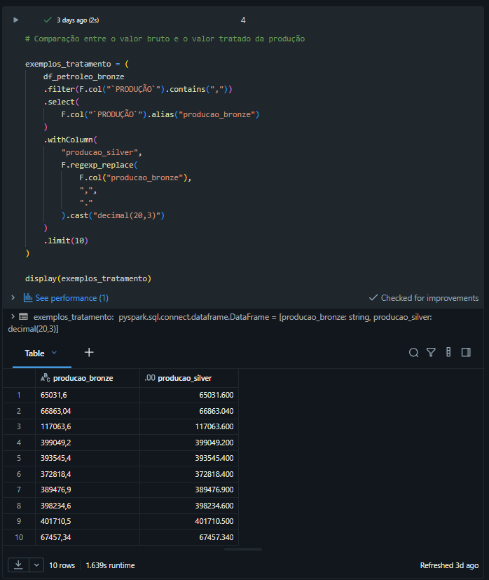
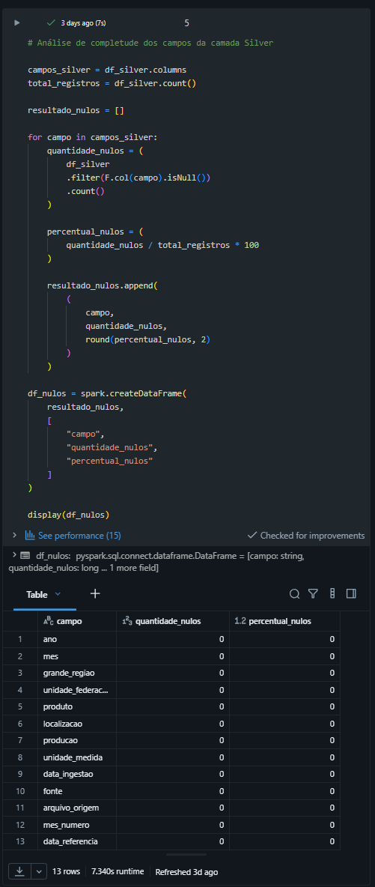
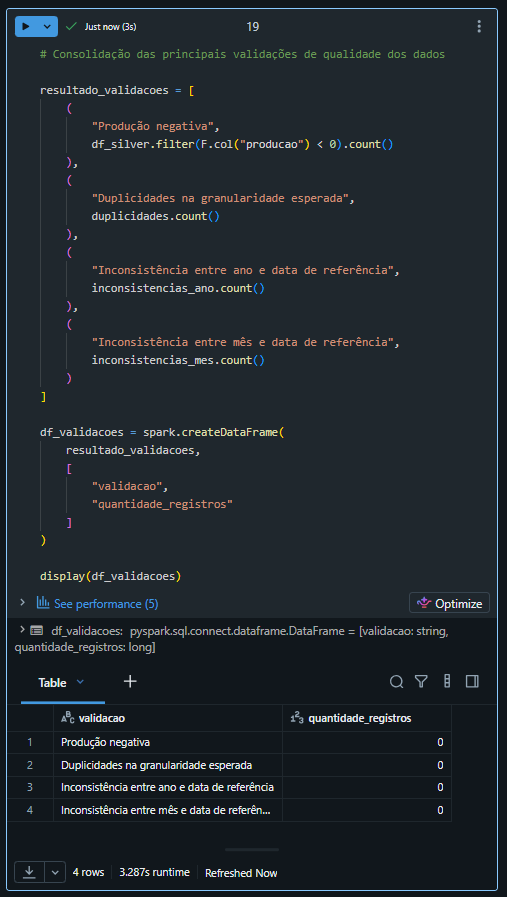
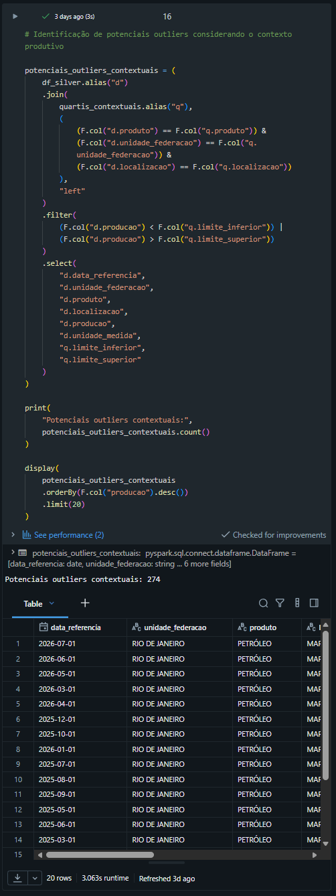
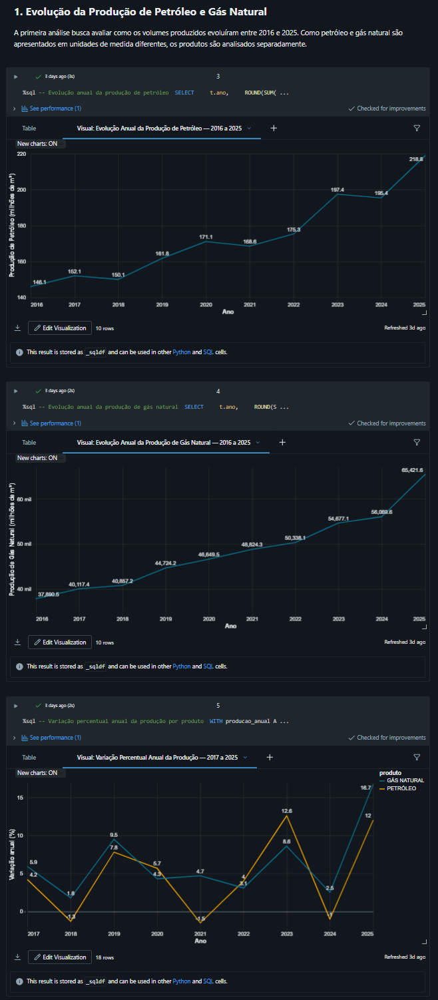
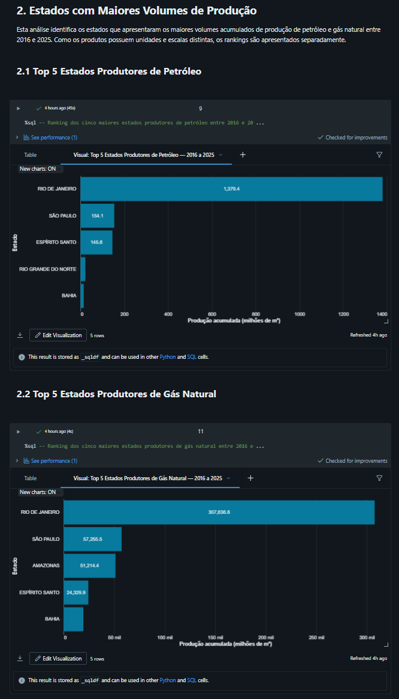
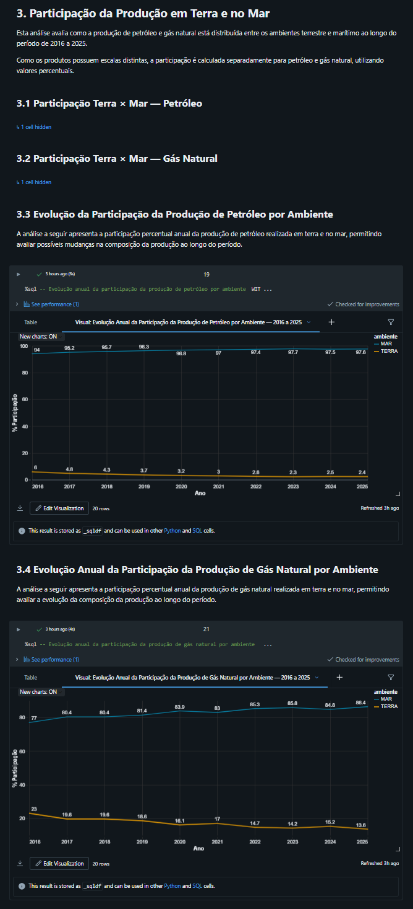
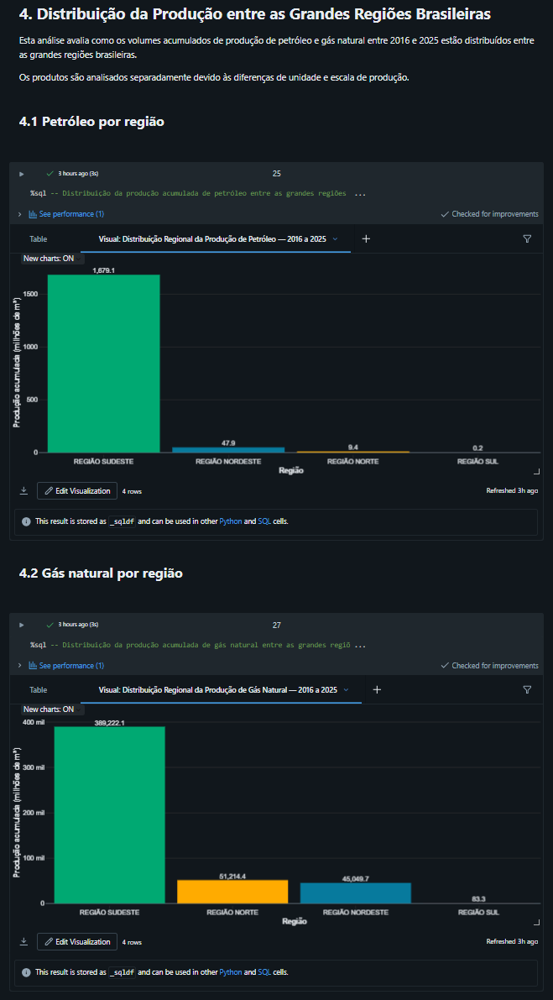
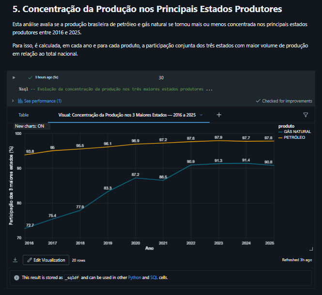

# MVP de Engenharia de Dados

## Pipeline de Dados para Análise da Produção de Petróleo e Gás Natural no Brasil

Este projeto foi desenvolvido como parte do MVP da disciplina de Engenharia de Dados e tem como objetivo demonstrar a construção de um pipeline completo de dados, desde a aquisição dos dados brutos até sua disponibilização em uma estrutura analítica adequada para geração de informações de negócio.

O projeto utiliza dados públicos disponibilizados pela Agência Nacional do Petróleo, Gás Natural e Biocombustíveis (ANP) e foi implementado no Databricks Free Edition utilizando arquitetura Medalhão, com as camadas Bronze, Silver e Gold.

A análise de negócio considera os anos completos entre **2016 e 2025**, enquanto as camadas Bronze e Silver preservam o histórico completo disponibilizado pela fonte.

---

# 1. Contexto de Negócio e Perguntas

A produção de petróleo e gás natural possui relevância para o setor energético brasileiro e apresenta diferenças significativas ao longo do tempo, entre regiões, estados e ambientes de produção terrestres e marítimos.

A Agência Nacional do Petróleo, Gás Natural e Biocombustíveis (ANP) disponibiliza dados públicos históricos relacionados à produção nacional de petróleo e gás natural. Entretanto, para que esses dados possam ser utilizados de maneira estruturada em análises, é necessário realizar etapas de ingestão, tratamento, padronização, modelagem e validação de qualidade.

Este projeto tem como objetivo construir um pipeline de Engenharia de Dados capaz de organizar esses dados em uma arquitetura analítica, preservando a rastreabilidade desde os arquivos originais até a camada final de consumo.

Para o escopo analítico do MVP, foi selecionado o período entre **2016 e 2025**, permitindo trabalhar com dez anos completos de produção e evitando comparações entre anos completos e o período parcial de 2026.

A partir dos dados processados, foram definidas as seguintes perguntas de negócio:

1. Como evoluiu a produção de petróleo e gás natural no Brasil entre 2016 e 2025?
2. Quais estados apresentam os maiores volumes de produção de petróleo e de gás natural?
3. Qual é a participação da produção realizada em terra e no mar ao longo do período?
4. Como a produção está distribuída entre as grandes regiões brasileiras?
5. A produção está ficando mais ou menos concentrada nos principais estados produtores?

Como petróleo e gás natural são disponibilizados originalmente em unidades de medida distintas, suas análises de volume são realizadas separadamente sempre que necessário.

---

# 2. Fonte e Coleta dos Dados
Os dados utilizados neste projeto foram obtidos no portal oficial de Dados Abertos da Agência Nacional do Petróleo, Gás Natural e Biocombustíveis (ANP).

Foram utilizados dois arquivos em formato CSV:

| Conjunto de dados | Arquivo utilizado | Unidade original |
|---|---|---|
| Produção de petróleo | `producao-petroleo-m3-1997-2026.csv` | m³ |
| Produção de gás natural | `producao-gas-natural-1000m3-1997-2026.csv` | mil m³ |

Os dois arquivos possuem estrutura semelhante, contendo os campos:

- `ANO`
- `MÊS`
- `GRANDE REGIÃO`
- `UNIDADE DA FEDERAÇÃO`
- `PRODUTO`
- `LOCALIZAÇÃO`
- `PRODUÇÃO`

Os dados disponibilizados pela ANP são atualizados mensalmente. Embora os arquivos contenham histórico a partir de 1997 e também registros de 2026, o recorte analítico utilizado na camada Gold considera apenas os anos completos entre **2016 e 2025**.

A aquisição dos dados foi realizada por download dos arquivos CSV disponibilizados no portal oficial da ANP. Após o download, os arquivos foram carregados em um Volume do Databricks, preservando os arquivos originais para posterior processamento.

### Fonte oficial
- [Portal de Dados Abertos da ANP](https://www.gov.br/anp/pt-br/centrais-de-conteudo/dados-abertos)
- [Produção de petróleo e gás natural por estado e localização](https://www.gov.br/anp/pt-br/centrais-de-conteudo/dados-abertos/producao-de-petroleo-e-gas-natural-por-estado-e-localizacao)
- [Arquivo de produção de petróleo](https://www.gov.br/anp/pt-br/centrais-de-conteudo/dados-abertos/arquivos/ppgn-el/producao-petroleo-m3.csv/view)
- [Arquivo de produção de gás natural](https://www.gov.br/anp/pt-br/centrais-de-conteudo/dados-abertos/arquivos/ppgn-el/producao-gas-natural-1000m3.csv/view)

### Licença e utilização dos dados

Os conjuntos utilizados são disponibilizados pela ANP como **dados abertos governamentais**.

De acordo com a Política de Dados Abertos do Poder Executivo Federal, dados abertos são disponibilizados sob licença aberta, permitindo sua utilização, reutilização e cruzamento, sujeitando-se, no máximo, à preservação da autoria ou da fonte.

Neste projeto, a ANP é mantida como fonte de origem dos dados durante todo o pipeline por meio dos metadados adicionados na camada Bronze.

---

# 3. Carga dos Dados

Após o download dos arquivos CSV disponibilizados pela ANP, os dados foram carregados no ambiente Databricks Free Edition.

Para armazenamento dos arquivos originais foi criado um Volume no Unity Catalog:

`workspace.bronze.raw_files`

Nesse Volume foram armazenados os seguintes arquivos:

- `producao-petroleo-m3-1997-2026.csv`
- `producao-gas-natural-1000m3-1997-2026.csv`

A camada Bronze foi utilizada para preservar os dados o mais próximo possível de sua estrutura original. Durante a ingestão, não foram aplicadas transformações de negócio ou padronizações dos campos.

Foram adicionados apenas metadados técnicos para garantir a rastreabilidade dos registros:

- `_data_ingestao`: data e horário da ingestão;
- `_fonte`: identificação da fonte dos dados;
- `_arquivo_origem`: nome do arquivo utilizado na carga.

Após a leitura dos arquivos com PySpark, os dados foram persistidos no formato Delta nas seguintes tabelas:

- `workspace.bronze.producao_petroleo_raw`
- `workspace.bronze.producao_gas_natural_raw`

A quantidade de registros persistidos foi validada após a carga:

| Tabela | Registros |
|---|---:|
| `producao_petroleo_raw` | 7.920 |
| `producao_gas_natural_raw` | 7.731 |
| **Total** | **15.651** |

### Evidência da carga e armazenamento

A imagem abaixo apresenta o Volume utilizado para armazenamento dos arquivos originais e as tabelas persistidas na camada Bronze.

---

# 4. Modelagem e Catálogo de Dados

A estrutura do projeto foi organizada utilizando a arquitetura Medalhão, separando os dados nas camadas **Bronze**, **Silver** e **Gold**.

Essa organização permite preservar os dados recebidos da fonte, realizar os processos de limpeza e padronização em uma camada intermediária e disponibilizar uma estrutura final modelada e preparada para consumo analítico.

Além da organização em camadas, as tabelas e seus respectivos campos foram documentados diretamente no **Unity Catalog do Databricks**, permitindo registrar informações sobre contexto, tipos de dados, domínios esperados, unidades de medida e rastreabilidade.

## 4.1 Camada Bronze

A camada Bronze contém os dados provenientes diretamente dos arquivos CSV disponibilizados pela ANP, preservando a estrutura original dos campos.

As tabelas criadas nesta camada são:

- `workspace.bronze.producao_petroleo_raw`
- `workspace.bronze.producao_gas_natural_raw`

Além dos campos provenientes dos arquivos originais, foram adicionados metadados técnicos para garantir a rastreabilidade dos registros:

- `_data_ingestao`: data e horário em que o registro foi ingerido;
- `_fonte`: identificação da fonte dos dados;
- `_arquivo_origem`: identificação do arquivo utilizado na carga.

Os dados permanecem nesta camada o mais próximo possível do formato recebido, deixando os processos de limpeza e padronização para a camada Silver.

### Evidências do catálogo da camada Bronze

A tabela de produção de petróleo foi documentada no Unity Catalog, contendo descrição da tabela, tipos dos campos e comentários.

A tabela de produção de gás natural também foi documentada, seguindo a mesma estrutura de catalogação.

---

## 4.2 Camada Silver

A camada Silver consolida os dados de produção de petróleo e gás natural em uma única estrutura, aplicando os processos de limpeza, padronização, tipagem e enriquecimento necessários para tornar os dados adequados para utilização analítica.

A tabela criada nesta camada é:

- `workspace.silver.producao_hidrocarbonetos`

Os principais tratamentos realizados foram:

- padronização dos nomes das colunas;
- conversão do campo `ano` para tipo inteiro;
- conversão do campo `producao` para `decimal(20,3)`;
- tratamento do separador decimal originalmente representado por vírgula;
- inclusão da unidade de medida correspondente a cada produto;
- consolidação das bases de petróleo e gás natural;
- criação do campo `mes_numero`;
- criação do campo `data_referencia`;
- preservação dos metadados de rastreabilidade provenientes da camada Bronze.

A camada Silver mantém o histórico completo disponível nos arquivos de origem, enquanto o recorte temporal utilizado nas análises é aplicado posteriormente na camada Gold.

### Evidência do catálogo da camada Silver

A tabela consolidada foi documentada diretamente no Unity Catalog, incluindo descrição dos campos, tipos de dados, domínios esperados e informações sobre as transformações realizadas.

---

## 4.3 Camada Gold

A camada Gold contém os dados modelados e estruturados para consumo analítico.

Para o escopo das análises deste MVP, foi aplicado o recorte temporal entre **2016 e 2025**, considerando apenas anos completos.

O modelo foi desenvolvido utilizando um **esquema estrela**, composto por uma tabela fato central relacionada a quatro dimensões.

As tabelas da camada Gold são:

- `workspace.gold.dim_tempo`
- `workspace.gold.dim_localidade`
- `workspace.gold.dim_produto`
- `workspace.gold.dim_ambiente`
- `workspace.gold.fato_producao`

### Estrutura do modelo dimensional

                       dim_tempo
                         |
                         |
    dim_localidade --- fato_producao --- dim_produto
                         |
                         |
                    dim_ambiente

A tabela `fato_producao` contém os volumes mensais produzidos e se relaciona com as dimensões de tempo, localidade, produto e ambiente.

### Evidência da estrutura do modelo Gold

A imagem abaixo apresenta as cinco tabelas persistidas na camada Gold do Unity Catalog.

---

## 4.4 Tabela Fato

### `fato_producao`

A tabela `fato_producao` representa o elemento central do modelo dimensional e armazena os volumes mensais de produção associados às respectivas dimensões.

A granularidade da tabela corresponde à produção mensal por combinação de:

- período;
- unidade da federação;
- produto;
- ambiente de produção.

Sua estrutura é composta pelos seguintes campos:

| Campo | Tipo | Descrição |
|---|---|---|
| `id_tempo` | int | Chave de relacionamento com a dimensão `dim_tempo` |
| `id_localidade` | bigint | Chave de relacionamento com a dimensão `dim_localidade` |
| `id_produto` | bigint | Chave de relacionamento com a dimensão `dim_produto` |
| `id_ambiente` | bigint | Chave de relacionamento com a dimensão `dim_ambiente` |
| `producao` | decimal(20,3) | Volume mensal de produção |

A unidade de medida do campo `producao` deve ser interpretada juntamente com a dimensão `dim_produto`, uma vez que petróleo e gás natural possuem unidades de origem diferentes.

### Evidência do catálogo da tabela fato

A tabela fato foi documentada no Unity Catalog com descrição da tabela, tipos dos campos e comentários associados a cada coluna.

---

## 4.5 Dimensões

### `dim_tempo`

A dimensão de tempo organiza os atributos temporais utilizados nas análises.

| Campo | Descrição |
|---|---|
| `id_tempo` | Chave temporal no formato AAAAMM |
| `data_referencia` | Data de referência mensal |
| `ano` | Ano de referência da produção |
| `mes` | Sigla do mês de referência |
| `mes_numero` | Número correspondente ao mês, entre 1 e 12 |

### `dim_localidade`

A dimensão de localidade organiza a informação geográfica associada aos registros de produção.

| Campo | Descrição |
|---|---|
| `id_localidade` | Chave técnica da localidade |
| `grande_regiao` | Grande região brasileira |
| `unidade_federacao` | Unidade da Federação |

### `dim_produto`

A dimensão de produto identifica o produto analisado e sua respectiva unidade de medida.

| Campo | Descrição |
|---|---|
| `id_produto` | Chave técnica do produto |
| `produto` | Produto analisado: PETRÓLEO ou GÁS NATURAL |
| `unidade_medida` | Unidade correspondente ao produto |

### `dim_ambiente`

A dimensão de ambiente representa a localização da atividade produtiva.

| Campo | Descrição |
|---|---|
| `id_ambiente` | Chave técnica do ambiente |
| `ambiente` | Ambiente de produção: TERRA ou MAR |

### Evidência do catálogo da dimensão de produto

A dimensão de produto foi utilizada como evidência representativa da documentação das dimensões no Unity Catalog.

---

## 4.6 Catálogo de Dados

As tabelas criadas ao longo do pipeline foram documentadas diretamente no **Unity Catalog do Databricks**.

A documentação contempla informações relacionadas a:

- contexto e finalidade das tabelas;
- nomes e descrições dos campos;
- tipos de dados;
- domínios esperados;
- unidades de medida;
- significado das chaves;
- origem dos dados;
- transformações realizadas;
- metadados utilizados para rastreabilidade.

A utilização do catálogo permite que a estrutura e o significado dos dados permaneçam documentados diretamente no ambiente em que o pipeline foi implementado, reduzindo a dependência de conhecimento externo sobre o significado das tabelas e dos campos.

A linhagem lógica implementada no projeto pode ser resumida da seguinte forma:

    Arquivos CSV da ANP
            |
            v
         Bronze
            |
            v
         Silver
            |
            v
          Gold
            |
            v
    Análises de Negócio

    ---

# 5. Pipeline de Dados

O pipeline foi desenvolvido no **Databricks Free Edition**, utilizando **PySpark**, **Spark SQL**, **Delta Lake** e **Unity Catalog**.

A implementação foi dividida em notebooks independentes de acordo com a responsabilidade de cada etapa do processo. Essa separação facilita a organização, manutenção, rastreabilidade e execução do pipeline.

O fluxo geral implementado pode ser representado da seguinte forma:

    Dados Abertos da ANP
            |
            v
      Arquivos CSV
            |
            v
    Volume raw_files
            |
            v
    Camada Bronze
    Dados brutos + metadados
            |
            v
    Camada Silver
    Limpeza + padronização
    + consolidação
            |
            v
      Camada Gold
    Modelo dimensional
            |
            v
    Qualidade de Dados
            |
            v
    Análises de Negócio

## 5.1 Organização dos Notebooks

O projeto foi dividido nos seguintes notebooks:

| Notebook | Responsabilidade |
|---|---|
| `00_setup` | Configuração inicial do ambiente, criação dos schemas Bronze, Silver e Gold e criação do Volume para armazenamento dos arquivos brutos |
| `01_ingestao_bronze` | Leitura dos arquivos CSV da ANP, inclusão de metadados técnicos e persistência das tabelas da camada Bronze |
| `02_transformacao_silver` | Limpeza, padronização, tipagem, consolidação e criação dos campos derivados da camada Silver |
| `03_modelagem_gold` | Aplicação do recorte temporal, criação das dimensões e da tabela fato e persistência do modelo dimensional |
| `04_qualidade_dados` | Execução das verificações de completude, consistência, unicidade, acurácia e identificação de potenciais outliers |
| `05_analise_negocio` | Consultas e visualizações utilizadas para responder às cinco perguntas de negócio |
| `06_catalogo_dados` | Registro das descrições das tabelas e campos diretamente no Unity Catalog |

Os códigos utilizados no desenvolvimento estão disponibilizados na pasta `notebooks` deste repositório.

---

## 5.2 Ingestão e Camada Bronze

A ingestão começa com os dois arquivos CSV disponibilizados pela ANP e armazenados no Volume:

`workspace.bronze.raw_files`

A leitura foi realizada utilizando PySpark, mantendo inicialmente todos os campos no formato original da fonte.

Na camada Bronze foram adicionados apenas metadados técnicos:

- `_data_ingestao`;
- `_fonte`;
- `_arquivo_origem`.

Os dados foram persistidos no formato Delta nas tabelas:

- `workspace.bronze.producao_petroleo_raw`;
- `workspace.bronze.producao_gas_natural_raw`.

Após a persistência, a quantidade de registros foi validada para garantir que não houve perda durante o processo de ingestão.

### Evidência da persistência na camada Bronze

---

## 5.3 Transformação e Camada Silver

A camada Silver foi construída a partir das duas tabelas da camada Bronze.

Nesta etapa foram aplicadas transformações de limpeza e padronização, incluindo:

- padronização dos nomes dos campos;
- conversão do campo `ano` para inteiro;
- tratamento do separador decimal da produção;
- conversão do campo `producao` para `decimal(20,3)`;
- definição explícita da unidade de medida de cada produto;
- consolidação das bases de petróleo e gás natural;
- criação do número do mês;
- criação da data de referência mensal;
- preservação dos campos de rastreabilidade.

Após as transformações, as duas bases foram consolidadas em uma única tabela:

`workspace.silver.producao_hidrocarbonetos`

A quantidade total de registros persistida na camada Silver foi de **15.651 registros**, preservando os registros existentes nas duas tabelas da Bronze.

---

## 5.4 Modelagem e Camada Gold

A camada Gold foi construída a partir da tabela consolidada da camada Silver.

Para atender ao escopo analítico definido para o MVP, foi aplicado o recorte temporal entre **2016 e 2025**, mantendo dez anos completos de produção.

A partir desses dados foi desenvolvido um modelo dimensional em esquema estrela.

Foram criadas as dimensões:

- `dim_tempo`;
- `dim_localidade`;
- `dim_produto`;
- `dim_ambiente`.

Também foi criada a tabela central:

- `fato_producao`.

A tabela fato contém **5.278 registros** correspondentes ao período selecionado para análise.

Durante a modelagem foram realizadas validações para verificar:

- unicidade das chaves das dimensões;
- ausência de chaves estrangeiras nulas na tabela fato;
- preservação da quantidade de registros após os relacionamentos;
- funcionamento dos relacionamentos entre fato e dimensões.

### Evidência da persistência na camada Gold

---

## 5.5 Persistência dos Dados

As tabelas das três camadas foram persistidas utilizando o formato **Delta**.

A utilização desse formato permite que os dados sejam armazenados dentro do ambiente Lakehouse do Databricks com uma estrutura preparada para consultas analíticas.

As principais tabelas persistidas durante o pipeline são:

### Bronze

- `workspace.bronze.producao_petroleo_raw`
- `workspace.bronze.producao_gas_natural_raw`

### Silver

- `workspace.silver.producao_hidrocarbonetos`

### Gold

- `workspace.gold.dim_tempo`
- `workspace.gold.dim_localidade`
- `workspace.gold.dim_produto`
- `workspace.gold.dim_ambiente`
- `workspace.gold.fato_producao`

---

## 5.6 Sequência de Execução

Para reproduzir o pipeline, os notebooks devem ser executados na seguinte ordem:

1. `00_setup`
2. `01_ingestao_bronze`
3. `02_transformacao_silver`
4. `03_modelagem_gold`
5. `04_qualidade_dados`
6. `05_analise_negocio`
7. `06_catalogo_dados`

Os quatro primeiros notebooks representam a construção principal do pipeline de dados.

Os notebooks posteriores realizam as etapas de validação da qualidade, análise dos resultados e documentação do catálogo.

---

## 5.7 Rastreabilidade

A rastreabilidade foi mantida ao longo do pipeline por meio dos metadados adicionados durante a ingestão:

- fonte do dado;
- arquivo de origem;
- data de ingestão.

Essas informações são preservadas na camada Silver, permitindo identificar a origem dos registros mesmo após os processos de transformação e consolidação.

A organização em camadas também permite acompanhar logicamente a evolução do dado durante o pipeline:

    CSV original
        |
        v
    Bronze
    dado recebido
        |
        v
    Silver
    dado tratado
        |
        v
    Gold
    dado modelado
        |
        v
    Análise
    informação para consumo

    ---

# 6. Qualidade dos Dados

A qualidade dos dados foi avaliada após a construção da camada Silver, utilizando verificações relacionadas à **completude, consistência, unicidade, validade dos valores e identificação de potenciais outliers**.

As validações foram implementadas no notebook:

`04_qualidade_dados`

O objetivo dessa etapa foi identificar problemas existentes nos dados de origem, verificar os tratamentos aplicados durante o pipeline e garantir que os dados utilizados na camada analítica apresentassem condições adequadas para análise.

---

## 6.1 Tratamento do Separador Decimal

Durante a análise dos dados da camada Bronze foi identificado que alguns valores do campo `PRODUÇÃO` utilizavam **vírgula como separador decimal**.

Exemplo:

`65031,6`

A conversão direta desse conteúdo para um tipo numérico poderia resultar em erro ou valor nulo.

Por esse motivo, durante a construção da camada Silver foi realizada a normalização do campo antes da conversão para `decimal(20,3)`.

Exemplo após o tratamento:

`65031,6` → `65031.600`

Esse tratamento permite preservar corretamente os volumes registrados na fonte.

### Evidência do tratamento

---

## 6.2 Completude

Foi realizada uma análise de valores nulos nos campos da tabela:

`workspace.silver.producao_hidrocarbonetos`

Foram avaliados os seguintes atributos:

- `ano`;
- `mes`;
- `grande_regiao`;
- `unidade_federacao`;
- `produto`;
- `localizacao`;
- `producao`;
- `unidade_medida`;
- `data_ingestao`;
- `fonte`;
- `arquivo_origem`;
- `mes_numero`;
- `data_referencia`.

O resultado da validação apresentou **zero valores nulos em todos os campos avaliados**.

Dessa forma, não foram identificados problemas de completude na estrutura final da camada Silver.

### Evidência da análise de completude

---

## 6.3 Consistência e Validade dos Dados

Também foram realizadas verificações relacionadas à consistência dos valores presentes na base.

### Domínio dos produtos

Foram identificados somente os produtos esperados:

- `PETRÓLEO`
- `GÁS NATURAL`

### Domínio da localização

Foram identificados somente os ambientes:

- `MAR`
- `TERRA`

### Meses

Foi validada a correspondência entre as siglas dos meses e o campo numérico `mes_numero`, garantindo valores entre 1 e 12.

### Produto e unidade de medida

Foi validada a associação entre cada produto e sua respectiva unidade:

| Produto | Unidade |
|---|---|
| PETRÓLEO | `m3` |
| GÁS NATURAL | `mil_m3` |

### Produção negativa

Foi realizada uma busca por valores de produção menores que zero.

**Resultado: 0 registros.**

### Consistência temporal

Foram comparados os campos derivados de data com seus campos de origem.

Foram verificadas:

- divergências entre `ano` e o ano presente em `data_referencia`;
- divergências entre `mes_numero` e o mês presente em `data_referencia`.

**Resultado: 0 inconsistências identificadas.**

---

## 6.4 Unicidade

A existência de registros duplicados foi avaliada considerando a granularidade esperada da tabela:

- `data_referencia`;
- `grande_regiao`;
- `unidade_federacao`;
- `produto`;
- `unidade_medida`;
- `localizacao`.

A combinação desses campos representa a granularidade utilizada para identificar os registros de produção.

**Resultado: 0 duplicidades identificadas.**

---

## 6.5 Consolidação das Principais Validações

As principais regras de qualidade foram consolidadas em uma única validação para facilitar a interpretação dos resultados.

| Validação | Resultado |
|---|---:|
| Produção negativa | 0 |
| Duplicidades na granularidade esperada | 0 |
| Inconsistência entre ano e data de referência | 0 |
| Inconsistência entre mês e data de referência | 0 |

### Evidência das validações

---

## 6.6 Identificação de Potenciais Outliers

Para identificação de valores extremos foi utilizado o método do **intervalo interquartil (IQR)**.

Em uma primeira avaliação, considerando apenas a separação por produto, foram identificados:

**2.114 potenciais outliers.**

Entretanto, os dados de produção possuem diferenças estruturais relevantes entre estados e ambientes de produção. Um estado com elevada produção marítima, por exemplo, pode apresentar valores muito superiores aos de outros estados sem que isso represente necessariamente um erro.

Por esse motivo, foi realizada uma segunda análise mais contextualizada, calculando os limites por combinação de:

- produto;
- unidade da federação;
- localização.

Após esse refinamento foram identificados:

**274 potenciais outliers contextuais.**

Os registros identificados não foram removidos automaticamente.

A presença de um valor estatisticamente extremo não significa necessariamente que o dado esteja incorreto. No contexto de produção de petróleo e gás natural, diferenças elevadas podem refletir características reais de produção de determinados estados e ambientes.

Por esse motivo, os registros foram mantidos e classificados apenas como valores que merecem atenção em análises futuras.

### Evidência da análise contextual de outliers

---

## 6.7 Integridade da Camada Gold

Além das verificações realizadas na Silver, também foi validada a integridade da modelagem dimensional.

Foram verificadas as chaves da tabela:

`workspace.gold.fato_producao`

Não foram identificadas chaves nulas nos relacionamentos com:

- `dim_tempo`;
- `dim_localidade`;
- `dim_produto`;
- `dim_ambiente`.

Também foi comparada a quantidade de registros da Silver no período de 2016 a 2025 com a quantidade de registros da tabela fato.

Ambas apresentaram:

**5.278 registros.**

Esse resultado indica que não houve perda de registros durante o processo de construção do modelo dimensional.

---

## 6.8 Conclusão da Qualidade dos Dados

As verificações realizadas demonstraram que o pipeline tratou adequadamente os principais aspectos de qualidade necessários para o projeto.

O principal problema identificado nos dados de origem foi a representação de valores decimais utilizando vírgula, situação tratada durante a transformação para a camada Silver.

Após os tratamentos e validações:

- não foram identificados valores nulos nos campos avaliados;
- não foram identificadas produções negativas;
- os domínios de produto e localização apresentaram valores esperados;
- não foram identificadas duplicidades na granularidade definida;
- não foram identificadas inconsistências temporais;
- as unidades de medida permaneceram associadas corretamente aos produtos;
- não foram identificadas chaves nulas no modelo dimensional;
- a quantidade de registros foi preservada durante a construção da camada Gold.

A análise estatística identificou potenciais outliers, porém esses registros foram mantidos por poderem representar diferenças reais de produção e não necessariamente problemas de qualidade.

---

# 7. Análise dos Dados

Após a construção e validação do pipeline, os dados da camada Gold foram utilizados para responder às cinco perguntas de negócio definidas no início do projeto.

As análises foram realizadas no notebook:

`05_analise_negocio`

Para facilitar a leitura dos resultados, os volumes foram apresentados em **milhões de m³**, mantendo petróleo e gás natural analisados separadamente, pois os arquivos de origem utilizam unidades distintas.

Para petróleo, o valor original em m³ foi convertido para milhões de m³.

Para gás natural, o valor original em mil m³ foi convertido para milhões de m³.

Os volumes dos dois produtos não foram somados entre si.

---

## 7.1 Como evoluiu a produção de petróleo e gás natural no Brasil entre 2016 e 2025?

A primeira análise avaliou a evolução anual da produção nacional de petróleo e gás natural durante os dez anos completos selecionados para o projeto.

Entre 2016 e 2025, a produção de petróleo passou de aproximadamente **146,1 milhões de m³** para **218,8 milhões de m³**.

No mesmo período, a produção de gás natural passou de aproximadamente **37.890,5 milhões de m³** para **65.421,6 milhões de m³**.

Considerando os valores observados no início e no final do período:

- a produção de petróleo apresentou crescimento aproximado de **49,8%**;
- a produção de gás natural apresentou crescimento aproximado de **72,7%**.

A análise da variação percentual anual também permitiu observar que a trajetória de crescimento não foi uniforme.

No caso do petróleo, ocorreram pequenas reduções em alguns anos, como 2018, 2021 e 2024, seguidas posteriormente por retomadas da produção.

No gás natural, a série apresentou crescimento ao longo do período analisado, com destaque para a expansão observada em 2025.

### Evidência da evolução da produção

### Conclusão

Os dois produtos apresentaram crescimento relevante entre 2016 e 2025. Entretanto, a evolução ocorreu em ritmos diferentes e, no caso do petróleo, com algumas oscilações ao longo da série.

---

## 7.2 Quais estados apresentam os maiores volumes de produção de petróleo e de gás natural?

A segunda análise avaliou o volume acumulado de produção por Unidade da Federação durante o período de 2016 a 2025.

Para petróleo, os cinco estados com maior produção acumulada foram:

1. Rio de Janeiro;
2. São Paulo;
3. Espírito Santo;
4. Rio Grande do Norte;
5. Bahia.

O Rio de Janeiro apresentou volume significativamente superior aos demais estados, com aproximadamente **1.379,4 milhões de m³** de petróleo produzidos no período.

Para gás natural, os cinco principais estados foram:

1. Rio de Janeiro;
2. São Paulo;
3. Amazonas;
4. Espírito Santo;
5. Bahia.

Também neste produto o Rio de Janeiro apresentou o maior volume acumulado.

### Evidência dos principais estados produtores

### Conclusão

O Rio de Janeiro ocupa posição de destaque na produção nacional tanto de petróleo quanto de gás natural.

Apesar de existirem outros estados relevantes, principalmente São Paulo, Espírito Santo e Amazonas, dependendo do produto analisado, a produção brasileira apresenta forte concentração nos principais estados produtores.

---

## 7.3 Qual é a participação da produção realizada em terra e no mar ao longo do período?

A terceira análise avaliou a distribuição da produção entre os ambientes **MAR** e **TERRA**.

No petróleo, a produção marítima já representava aproximadamente **94,0%** da produção nacional em 2016.

Em 2025, essa participação alcançou aproximadamente **97,6%**.

Consequentemente, a participação terrestre passou de aproximadamente 6,0% para 2,4% no mesmo período.

No gás natural também foi observada predominância da produção marítima.

A participação da produção no mar passou de aproximadamente **77,0% em 2016** para **86,4% em 2025**.

A produção terrestre de gás natural, por sua vez, reduziu sua participação relativa de aproximadamente 23,0% para 13,6%.

### Evidência da participação Terra × Mar

### Conclusão

A produção nacional de petróleo e gás natural apresenta forte predominância do ambiente marítimo.

Além dessa predominância, os resultados indicam aumento da participação relativa da produção offshore durante o período analisado, principalmente no petróleo.

---

## 7.4 Como a produção está distribuída entre as grandes regiões brasileiras?

A quarta análise agrupou os volumes de produção pelas grandes regiões brasileiras.

Na produção de petróleo, a região Sudeste apresentou aproximadamente **96,7%** do volume acumulado entre 2016 e 2025.

As demais regiões apresentaram participação significativamente menor no total produzido.

No gás natural, a região Sudeste também apresentou a maior participação, correspondendo a aproximadamente **80,2%** da produção acumulada no período.

Entretanto, neste produto também se observa participação relevante das regiões Norte e Nordeste.

### Evidência da distribuição regional

### Conclusão

A produção brasileira está fortemente concentrada na região Sudeste.

Essa concentração é especialmente elevada no petróleo. No gás natural, embora o Sudeste permaneça dominante, existe maior participação relativa de outras regiões, principalmente Norte e Nordeste.

---

## 7.5 A produção está ficando mais ou menos concentrada nos principais estados produtores?

Para avaliar a concentração geográfica da produção, foi calculada a participação dos **três maiores estados produtores de cada ano** sobre a produção nacional daquele produto.

No petróleo, os três maiores estados representavam aproximadamente **93,8%** da produção nacional em 2016.

Em 2025, essa participação alcançou aproximadamente **97,8%**.

Isso representa aumento de aproximadamente **4,0 pontos percentuais** na concentração dos três maiores produtores.

No gás natural, a mudança foi ainda mais expressiva.

Os três principais estados representavam aproximadamente **72,7%** da produção em 2016 e passaram a representar aproximadamente **90,8%** em 2025.

O aumento observado foi de aproximadamente **18,1 pontos percentuais**.

### Evidência da concentração dos principais estados

### Conclusão

Os resultados indicam aumento da concentração geográfica da produção nos principais estados produtores durante o período analisado.

Esse movimento ocorre nos dois produtos, mas é especialmente significativo no gás natural.

---

## 7.6 Conclusão das Análises

A análise dos dados entre 2016 e 2025 permitiu identificar algumas características importantes da produção brasileira de petróleo e gás natural.

Os principais resultados foram:

- crescimento da produção dos dois produtos ao longo do período;
- liderança do Rio de Janeiro entre os estados produtores;
- forte predominância da produção realizada no mar;
- elevada participação da região Sudeste na produção nacional;
- aumento da concentração da produção nos principais estados produtores.

Os resultados demonstram como a construção de um pipeline estruturado permite transformar os dados brutos disponibilizados pela ANP em informações organizadas e adequadas para análise.

A arquitetura desenvolvida possibilitou preservar os dados de origem, aplicar tratamentos de qualidade, estruturar um modelo dimensional e responder às perguntas de negócio definidas para o MVP.
---

# 8. Autoavaliação

O desenvolvimento deste MVP foi uma oportunidade de colocar em prática várias etapas que normalmente aparecem separadas durante o estudo de Engenharia de Dados. Ao longo do projeto, trabalhei desde a obtenção dos arquivos da ANP até a construção das tabelas finais utilizadas nas análises.

Procurei não tratar o trabalho apenas como uma sequência de notebooks. A ideia foi entender o papel de cada etapa e manter uma lógica clara entre os dados recebidos, os tratamentos realizados e o resultado final disponibilizado para análise.

## 8.1 Resultados Alcançados

O pipeline foi estruturado nas camadas Bronze, Silver e Gold.

Na camada Bronze foram carregados **7.920 registros de petróleo** e **7.731 registros de gás natural**, totalizando **15.651 registros**. Esses dados foram mantidos próximos ao formato original, acrescentando apenas informações de rastreabilidade.

Na Silver, as duas fontes foram tratadas e consolidadas em uma única tabela. Já na Gold, optei por trabalhar com o período entre **2016 e 2025**, por serem dez anos completos dentro da base disponível.

Esse recorte resultou em **5.278 registros** na tabela fato, além das dimensões de tempo, localidade, produto e ambiente.

Com essa estrutura foi possível responder às cinco perguntas de negócio definidas no início do projeto e, ao mesmo tempo, manter uma separação clara entre dado bruto, dado tratado e dado preparado para análise.

## 8.2 Principais Desafios

Um dos primeiros problemas que encontrei foi no campo de produção. Parte dos valores utilizava vírgula como separador decimal, como no valor `65031,6`.

Antes de perceber isso, uma conversão direta poderia gerar erro ou perda de informação. Por isso, foi necessário normalizar esses valores antes de convertê-los para um tipo numérico.

Outro ponto que exigiu atenção foi a unidade de medida. Petróleo e gás natural possuem unidades diferentes na fonte, então não faria sentido simplesmente juntar os volumes e tratá-los como uma mesma medida. A solução foi manter a unidade associada ao produto e realizar as análises separadamente quando necessário.

Também tive que tomar cuidado durante a construção do modelo dimensional para não perder registros nos relacionamentos entre a fato e as dimensões. Por isso, além de criar o modelo, fiz validações comparando as quantidades antes e depois da transformação.

A análise de outliers também foi um ponto interessante. Quando fiz uma avaliação mais geral, apareceram **2.114 potenciais outliers**, um número muito alto. Ao analisar melhor, percebi que comparar estados e ambientes muito diferentes poderia fazer com que valores legítimos fossem classificados como anormais.

Refiz então a análise considerando produto, estado e localização, chegando a **274 potenciais outliers contextuais**. Mesmo assim, optei por não remover esses registros, já que um valor elevado de produção pode representar uma característica real da atividade e não necessariamente um erro na base.

## 8.3 Aprendizados

O principal aprendizado deste trabalho foi perceber na prática a importância da separação das responsabilidades dentro de um pipeline.

A Bronze ficou responsável por preservar o dado recebido. A Silver concentrou os tratamentos e padronizações. A Gold passou a representar a visão preparada para análise.

Antes do desenvolvimento, essa divisão parecia muito mais conceitual. Durante o projeto ficou mais claro como ela ajuda a localizar problemas, entender a origem dos dados e evitar que regras de tratamento fiquem misturadas com regras de negócio.

Também consegui praticar o uso de PySpark, Spark SQL, tabelas Delta, Unity Catalog e modelagem dimensional dentro de um mesmo projeto, em vez de trabalhar esses assuntos de maneira isolada.

Outro aprendizado importante foi que qualidade de dados não significa simplesmente excluir tudo que parece diferente. No caso dos outliers, por exemplo, foi necessário entender o contexto antes de decidir se os valores realmente representavam algum problema.

## 8.4 Melhorias Futuras

Embora o pipeline atenda ao objetivo deste MVP, algumas partes poderiam ser evoluídas.

Hoje a aquisição dos arquivos é feita manualmente. Uma próxima versão poderia buscar os dados diretamente na fonte da ANP e processar apenas novos períodos, evitando a necessidade de recarregar todo o histórico.

Também seria interessante automatizar a execução dos notebooks, criar regras de qualidade mais formais e incluir alertas para situações como falhas de carga, mudanças de estrutura ou valores fora do esperado.

Outra evolução seria utilizar os dados da Gold em um dashboard e incorporar novas fontes do setor de petróleo e gás, ampliando as possibilidades de análise.

## 8.5 Considerações Finais

Considero que o MVP cumpriu o que eu pretendia desenvolver: partir de arquivos públicos da ANP e chegar a uma estrutura de dados organizada, documentada e preparada para análise.

Mais do que gerar os gráficos finais, o trabalho ajudou a entender melhor todo o caminho percorrido pelo dado e a importância das etapas anteriores à análise.

Os principais desafios surgiram justamente nos detalhes da base, como tratamento dos valores numéricos, diferenças de unidade e interpretação dos outliers. Resolver esses pontos tornou o projeto mais próximo de uma situação real de Engenharia de Dados e foi a parte que mais agregou aprendizado durante o desenvolvimento.

---

# 9. Estrutura do Repositório

A organização dos arquivos deste repositório é apresentada abaixo:

    puc_mvp-engenharia-dados-anp/
    │
    ├── README.md
    │
    ├── notebooks/
    │   ├── 00_setup.sql
    │   ├── 01_ingestao_bronze.sql
    │   ├── 02_transformacao_silver.py
    │   ├── 03_modelagem_gold.py
    │   ├── 04_qualidade_dados.py
    │   ├── 05_analise_negocio.py
    │   └── 06_catalogo_dados.sql
    │
    └── docs/
        └── screenshots/
            ├── bronze_estrutura_e_arquivos.png
            ├── bronze_catalogo_petroleo.png
            ├── bronze_catalogo_gn.png
            ├── silver_catalogo_producao_hidrocarbonetos.png
            ├── gold_estrutura_modelo.png
            ├── gold_catalogo_fato_producao.png
            ├── gold_catalogo_dim_produto.png
            ├── qualidade_tratamento_decimal.png
            ├── qualidade_completude.png
            ├── qualidade_validacoes.png
            ├── qualidade_outliers_contextuais.png
            ├── analise_01_evolucao_producao.png
            ├── analise_02_top5_estados.png
            ├── analise_03_terra_mar.png
            ├── analise_04_regioes.png
            └── analise_05_concentracao_top3.png
